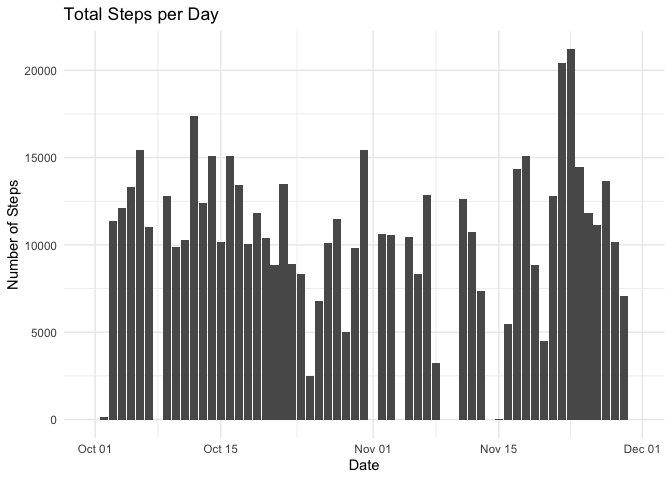
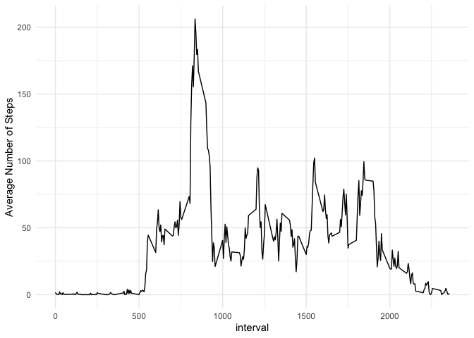
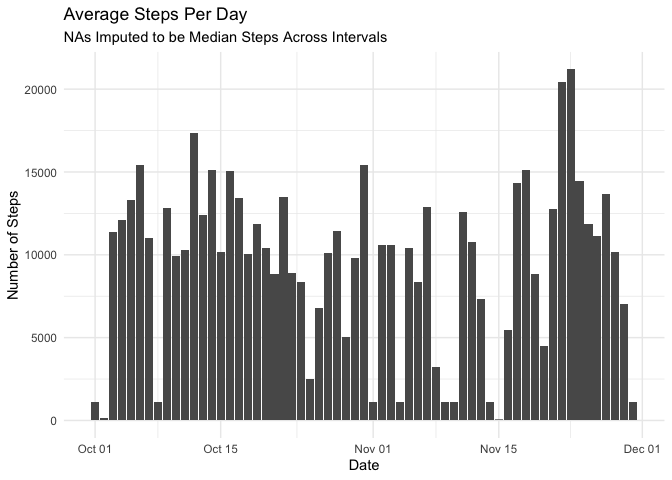
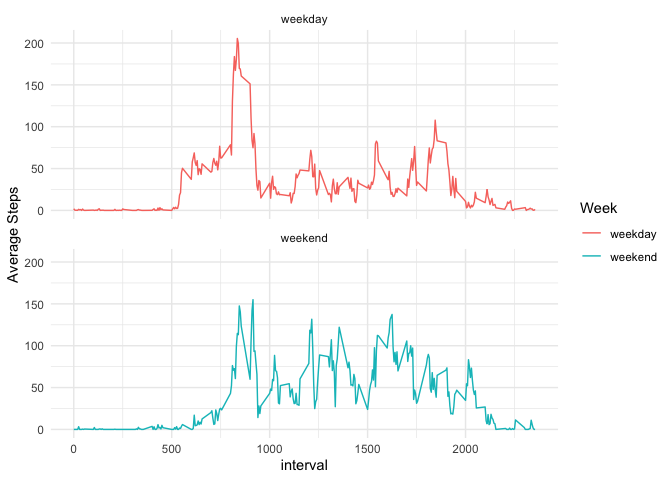

# Loading and preprocessing the data
I utilize the tidyverse to read in the data with reader and then group the
created data frame by the floor of the day.

```r
# For this part of the assignment, you can ignore the missing values in the dataset.
library(tidyverse);library(lubridate);library(DT)
```

```
## ── Attaching packages ─────────────────────────────────────── tidyverse 1.3.2 ──
## ✔ ggplot2 3.4.0      ✔ purrr   1.0.1 
## ✔ tibble  3.1.8      ✔ dplyr   1.0.10
## ✔ tidyr   1.2.1      ✔ stringr 1.5.0 
## ✔ readr   2.1.3      ✔ forcats 0.5.2 
## ── Conflicts ────────────────────────────────────────── tidyverse_conflicts() ──
## ✖ dplyr::filter() masks stats::filter()
## ✖ dplyr::lag()    masks stats::lag()
## Loading required package: timechange
## 
## 
## Attaching package: 'lubridate'
## 
## 
## The following objects are masked from 'package:base':
## 
##     date, intersect, setdiff, union
```

```r
myData <- read_csv("activity.csv")
```

```
## Rows: 17568 Columns: 3
## ── Column specification ────────────────────────────────────────────────────────
## Delimiter: ","
## dbl  (2): steps, interval
## date (1): date
## 
## ℹ Use `spec()` to retrieve the full column specification for this data.
## ℹ Specify the column types or set `show_col_types = FALSE` to quiet this message.
```

```r
head(myData)
```

```
## # A tibble: 6 × 3
##   steps date       interval
##   <dbl> <date>        <dbl>
## 1    NA 2012-10-01        0
## 2    NA 2012-10-01        5
## 3    NA 2012-10-01       10
## 4    NA 2012-10-01       15
## 5    NA 2012-10-01       20
## 6    NA 2012-10-01       25
```

I do not see any reason to perform any data transformations with the intial data as it al imported with appropriate types

# What is mean total number of steps taken per day?

```r
# Make a histogram of the total number of steps taken each day
steps_per_day <-myData %>% group_by(date) %>% 
 summarize("Steps Per Day" = sum(steps,na.rm = TRUE))
stepsPerDayPlot <- steps_per_day %>% drop_na() %>% 
  ggplot(aes(y=`Steps Per Day`,x=date))+
  geom_bar(stat="identity") +
  ggtitle("Total Steps per Day")+
  theme_minimal()+
  xlab("Date")+
  ylab("Number of Steps")
stepsPerDayPlot
```

<!-- -->

```r
# Calculate and report the mean and median total number of steps taken per day
StepsPerDaySummary <-steps_per_day %>% drop_na() %>% 
  summarise(
    "Median Steps Per Day" = median(`Steps Per Day`),
    "Average Steps Per Day" = mean(`Steps Per Day`)
  )
orginalMedianStepsPerDay <- as.numeric(StepsPerDaySummary[1][1])
orginalMeanStepsPerDay <- as.numeric(StepsPerDaySummary[2][1])
DT::datatable(StepsPerDaySummary,caption = "The Median and Average Steps per Day.",rownames = FALSE, options = list(
  dom="t",
  columnDefs = list(list(className = 'dt-center', targets="_all"))
))
```

```{=html}
<div class="datatables html-widget html-fill-item-overflow-hidden html-fill-item" id="htmlwidget-032c8ecfbf2b9b4b7214" style="width:100%;height:auto;"></div>
<script type="application/json" data-for="htmlwidget-032c8ecfbf2b9b4b7214">{"x":{"filter":"none","vertical":false,"caption":"<caption>The Median and Average Steps per Day.<\/caption>","data":[[10395],[9354.22950819672]],"container":"<table class=\"display\">\n  <thead>\n    <tr>\n      <th>Median Steps Per Day<\/th>\n      <th>Average Steps Per Day<\/th>\n    <\/tr>\n  <\/thead>\n<\/table>","options":{"dom":"t","columnDefs":[{"className":"dt-center","targets":"_all"}],"order":[],"autoWidth":false,"orderClasses":false}},"evals":[],"jsHooks":[]}</script>
```
The average steps per day was 9354.2295082 and the median steps per day was 1.0395\times 10^{4}.


# What is the average daily activity pattern?

```r
# Make a time series plot (i.e. type = "l") of the 5-minute interval (x-axis) and the average number of steps taken, averaged across all days (y-axis)
myData  %>% 
  group_by(interval) %>%
  drop_na() %>% 
  summarise(
    "Average Number of Steps" = mean(steps)
  ) %>% ggplot(aes(y=`Average Number of Steps`,x=interval))+geom_line()+theme_minimal()
```

<!-- -->

```r
# Which 5-minute interval, on average across all the days in the dataset, contains the maximum number of steps?
MaxStepsIntervalSummary <-myData  %>% 
  group_by(interval) %>%
  drop_na() %>% 
  summarise(
    "Average Number of Steps" = mean(steps)
  ) %>% slice_max(`Average Number of Steps`)
DT::datatable(MaxStepsIntervalSummary,caption = "Interval with Max Average Steps",rownames = FALSE, options = list(
  dom="t",
  columnDefs = list(list(className = 'dt-center', targets="_all"))
))
```

```{=html}
<div class="datatables html-widget html-fill-item-overflow-hidden html-fill-item" id="htmlwidget-586110ca0b1a507f09b7" style="width:100%;height:auto;"></div>
<script type="application/json" data-for="htmlwidget-586110ca0b1a507f09b7">{"x":{"filter":"none","vertical":false,"caption":"<caption>Interval with Max Average Steps<\/caption>","data":[[835],[206.169811320755]],"container":"<table class=\"display\">\n  <thead>\n    <tr>\n      <th>interval<\/th>\n      <th>Average Number of Steps<\/th>\n    <\/tr>\n  <\/thead>\n<\/table>","options":{"dom":"t","columnDefs":[{"className":"dt-center","targets":"_all"}],"order":[],"autoWidth":false,"orderClasses":false}},"evals":[],"jsHooks":[]}</script>
```

```r
maxStepInterval <- as.numeric(MaxStepsIntervalSummary[1][1])
maxAverageSteps <- as.numeric(MaxStepsIntervalSummary[2][1])
```
The interval with the maximum average number of steps was 835 with an average step count of 206.1698113.


## Imputing missing values

```r
#Calculate and report the total number of missing values in the dataset (i.e. the total number of rows with NAs
naCountSteps <-sum(is.na(myData$steps))
naCountSteps
```

```
## [1] 2304
```

```r
naCountDate <- sum(is.na(myData$date))
naCountDate
```

```
## [1] 0
```

```r
naCountInterval <- sum(is.na(myData$interval))
naCountInterval
```

```
## [1] 0
```

```r
NaCountSummarySteps <-myData %>% 
  filter(is.na(steps)) %>% 
  summarise(
    "Total NAs in steps" = n()
  )
DT::datatable(NaCountSummarySteps,caption = "Total NAs Count in Steps.",rownames = FALSE, options = list(
  dom="t",
  columnDefs = list(list(className = 'dt-center', targets="_all"))
))
```

```{=html}
<div class="datatables html-widget html-fill-item-overflow-hidden html-fill-item" id="htmlwidget-dc51c117f793219b8e9f" style="width:100%;height:auto;"></div>
<script type="application/json" data-for="htmlwidget-dc51c117f793219b8e9f">{"x":{"filter":"none","vertical":false,"caption":"<caption>Total NAs Count in Steps.<\/caption>","data":[[2304]],"container":"<table class=\"display\">\n  <thead>\n    <tr>\n      <th>Total NAs in steps<\/th>\n    <\/tr>\n  <\/thead>\n<\/table>","options":{"dom":"t","columnDefs":[{"className":"dt-center","targets":"_all"}],"order":[],"autoWidth":false,"orderClasses":false}},"evals":[],"jsHooks":[]}</script>
```

The total count of NAs found in steps was 2304, the total count of NAs found in date was 0, and the total count on NAs found in interval was 0


```r
# Devise a strategy for filling in all of the missing values in the dataset. The strategy does not need to be sophisticated. For example, you could use the mean/median for that day, or the mean for that 5-minute interval, etc.
# I am going to use the median across the individual intervals to impute the missing values.
imputedData<- myData %>% 
  group_by(interval) %>% 
  mutate(across(steps, ~replace_na(.,median(.,na.rm=TRUE)))) %>% 
  ungroup() 

imputedDataSummary <-imputedData %>% 
  filter(is.na(steps)) %>% 
  summarise(
    "Total NAs in steps" = n()
  )
DT::datatable(imputedDataSummary,caption = "The Count of NAs after Imputing them for the Median.",rownames = FALSE, options = list(
  dom="t",
  columnDefs = list(list(className = 'dt-center', targets="_all"))
))
```

```{=html}
<div class="datatables html-widget html-fill-item-overflow-hidden html-fill-item" id="htmlwidget-262312a02aacc07da667" style="width:100%;height:auto;"></div>
<script type="application/json" data-for="htmlwidget-262312a02aacc07da667">{"x":{"filter":"none","vertical":false,"caption":"<caption>The Count of NAs after Imputing them for the Median.<\/caption>","data":[[0]],"container":"<table class=\"display\">\n  <thead>\n    <tr>\n      <th>Total NAs in steps<\/th>\n    <\/tr>\n  <\/thead>\n<\/table>","options":{"dom":"t","columnDefs":[{"className":"dt-center","targets":"_all"}],"order":[],"autoWidth":false,"orderClasses":false}},"evals":[],"jsHooks":[]}</script>
```

```r
# Create a new dataset that is equal to the original dataset but with the missing data filled in.
# Make a histogram of the total number of steps taken each day and Calculate and report the mean and median total number of steps taken per day. Do these values differ from the estimates from the first part of the assignment? What is the impact of imputing missing data on the estimates of the total daily number of steps?
imputed_steps_per_day <-imputedData %>% group_by(date) %>% 
 summarize("Steps Per Day" = sum(steps,na.rm = TRUE)) %>% ungroup()
imputedStepsPerDayPlot <- imputed_steps_per_day %>%  
  ggplot(aes(y=`Steps Per Day`,x=date))+
  geom_bar(stat="identity") +
  ggtitle("Total Steps per Day")+
  theme_minimal()+
  xlab("Date")+
  ylab("Number of Steps")
stepsPerDayPlot + ggtitle("Average Steps Per Day",subtitle = "NAs Dropped")
```

<!-- -->

```r
imputedStepsPerDayPlot+ ggtitle("Average Steps Per Day",subtitle="NAs Imputed to be Median Steps Across Intervals")
```

<!-- -->

```r
imputedStepsPerDaySummary <- imputed_steps_per_day %>% 
  summarise(
    "Median Steps Per Day" = median(`Steps Per Day`),
    "Average Steps Per Day" = mean(`Steps Per Day`)
  )
DT::datatable(StepsPerDaySummary,caption = "The Median and Average Steps per Day.",rownames = FALSE, options = list(
  dom="t",
  columnDefs = list(list(className = 'dt-center', targets="_all"))
))
```

```{=html}
<div class="datatables html-widget html-fill-item-overflow-hidden html-fill-item" id="htmlwidget-365c93e1346ef71c3246" style="width:100%;height:auto;"></div>
<script type="application/json" data-for="htmlwidget-365c93e1346ef71c3246">{"x":{"filter":"none","vertical":false,"caption":"<caption>The Median and Average Steps per Day.<\/caption>","data":[[10395],[9354.22950819672]],"container":"<table class=\"display\">\n  <thead>\n    <tr>\n      <th>Median Steps Per Day<\/th>\n      <th>Average Steps Per Day<\/th>\n    <\/tr>\n  <\/thead>\n<\/table>","options":{"dom":"t","columnDefs":[{"className":"dt-center","targets":"_all"}],"order":[],"autoWidth":false,"orderClasses":false}},"evals":[],"jsHooks":[]}</script>
```

```r
DT::datatable(imputedStepsPerDaySummary,caption = "The Median and Average Steps per Day with NAs Imputed to Median.",rownames = FALSE, options = list(
  dom="t",
  columnDefs = list(list(className = 'dt-center', targets="_all"))
))
```

```{=html}
<div class="datatables html-widget html-fill-item-overflow-hidden html-fill-item" id="htmlwidget-d37342ea612a18acbf4a" style="width:100%;height:auto;"></div>
<script type="application/json" data-for="htmlwidget-d37342ea612a18acbf4a">{"x":{"filter":"none","vertical":false,"caption":"<caption>The Median and Average Steps per Day with NAs Imputed to Median.<\/caption>","data":[[10395],[9503.86885245902]],"container":"<table class=\"display\">\n  <thead>\n    <tr>\n      <th>Median Steps Per Day<\/th>\n      <th>Average Steps Per Day<\/th>\n    <\/tr>\n  <\/thead>\n<\/table>","options":{"dom":"t","columnDefs":[{"className":"dt-center","targets":"_all"}],"order":[],"autoWidth":false,"orderClasses":false}},"evals":[],"jsHooks":[]}</script>
```

```r
imputedMedianStepsPerDay <- as.numeric(imputedStepsPerDaySummary[1][1])
imputedMeanStepsPerDay <- as.numeric(imputedStepsPerDaySummary[2][1])
deltaMedian <- imputedMedianStepsPerDay - orginalMedianStepsPerDay
deltaMean <- imputedMeanStepsPerDay - orginalMeanStepsPerDay
percentChangeMean <- (deltaMean/orginalMeanStepsPerDay)*100
```

 Yes, imputing the missing values with the median across the individual intervals causes the mean, with a percent change of 1.5996972% to be skewed upwards however the median remains the same. The impact on the average daily steps was not to great which is evedent in the graph of average steps per day. This shows that great care should be taken when imputing missing values as it can skew the final data analysis.
 
## Are there differences in activity patterns between weekdays and weekends?

```r
library(lubridate)
# For this part the weekdays() function may be of some help here. Use the dataset with the filled-in missing values for this part.

# Create a new factor variable in the dataset with two levels -- "weekday" and "weekend" indicating whether a given date is a weekday or weekend day.

imputedData %>% 
  mutate(
    Week = case_when(
      wday(date)==1|wday(date)==7 ~ "weekend",
      wday(date)>1 & wday(date)<7 ~ "weekday"),
    Week =as_factor(Week)
    ) %>% 
  group_by(interval, Week) %>%
  summarise(
    "Average Steps" = mean(steps),
  .groups = "keep") %>% 
  ggplot(aes(y=`Average Steps`,x=interval,color=Week))+geom_line()+facet_wrap(vars(Week),nrow = 2,strip.position = "top") + theme_minimal()
```

<!-- -->

Yes there is a difference in the ativity pattern between weekdays and weekends.

# R Session Information


```r
sessionInfo()
```

```
## R version 4.2.2 (2022-10-31)
## Platform: aarch64-apple-darwin20 (64-bit)
## Running under: macOS Ventura 13.1
## 
## Matrix products: default
## BLAS:   /Library/Frameworks/R.framework/Versions/4.2-arm64/Resources/lib/libRblas.0.dylib
## LAPACK: /Library/Frameworks/R.framework/Versions/4.2-arm64/Resources/lib/libRlapack.dylib
## 
## locale:
## [1] en_US.UTF-8/en_US.UTF-8/en_US.UTF-8/C/en_US.UTF-8/en_US.UTF-8
## 
## attached base packages:
## [1] stats     graphics  grDevices utils     datasets  methods   base     
## 
## other attached packages:
##  [1] DT_0.27          lubridate_1.9.0  timechange_0.2.0 forcats_0.5.2   
##  [5] stringr_1.5.0    dplyr_1.0.10     purrr_1.0.1      readr_2.1.3     
##  [9] tidyr_1.2.1      tibble_3.1.8     ggplot2_3.4.0    tidyverse_1.3.2 
## 
## loaded via a namespace (and not attached):
##  [1] assertthat_0.2.1    digest_0.6.31       utf8_1.2.2         
##  [4] R6_2.5.1            cellranger_1.1.0    backports_1.4.1    
##  [7] reprex_2.0.2        evaluate_0.20       highr_0.10         
## [10] httr_1.4.4          pillar_1.8.1        rlang_1.0.6        
## [13] googlesheets4_1.0.1 readxl_1.4.1        rstudioapi_0.14    
## [16] jquerylib_0.1.4     rmarkdown_2.20      labeling_0.4.2     
## [19] googledrive_2.0.0   htmlwidgets_1.6.1   bit_4.0.5          
## [22] munsell_0.5.0       broom_1.0.2         compiler_4.2.2     
## [25] modelr_0.1.10       xfun_0.36           pkgconfig_2.0.3    
## [28] htmltools_0.5.4     tidyselect_1.2.0    fansi_1.0.3        
## [31] crayon_1.5.2        tzdb_0.3.0          dbplyr_2.3.0       
## [34] withr_2.5.0         grid_4.2.2          jsonlite_1.8.4     
## [37] gtable_0.3.1        lifecycle_1.0.3     DBI_1.1.3          
## [40] magrittr_2.0.3      scales_1.2.1        cli_3.6.0          
## [43] stringi_1.7.12      vroom_1.6.0         cachem_1.0.6       
## [46] farver_2.1.1        fs_1.5.2            xml2_1.3.3         
## [49] bslib_0.4.2         ellipsis_0.3.2      generics_0.1.3     
## [52] vctrs_0.5.1         tools_4.2.2         bit64_4.0.5        
## [55] glue_1.6.2          crosstalk_1.2.0     hms_1.1.2          
## [58] parallel_4.2.2      fastmap_1.1.0       yaml_2.3.6         
## [61] colorspace_2.0-3    gargle_1.2.1        rvest_1.0.3        
## [64] knitr_1.41          haven_2.5.1         sass_0.4.4
```


